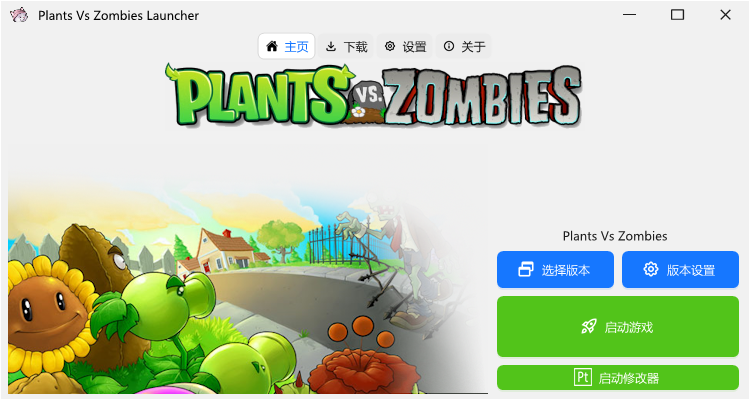

# [归档声明]植物大战僵尸启动器 - 最终版本发布
(继续向下翻可查看自述文件)

**项目名称**：植物大战僵尸启动器  
**版本状态**：长期支持版 (LTS)  
**归档日期**：2025年6月1日  

## 📢 声明内容

本项目 **《植物大战僵尸启动器》** 的开发工作已全部完成，并发布最终稳定版本（LTS 1.3）。即日起，项目进入**归档状态（Archived）**，代表：

1. **功能完善**：所有设计功能均已实现，包括游戏快捷启动、版本切换、窗口化设置、存档管理等核心特性；  
2. **停止更新**：不再新增功能或修复非严重性问题；  
3. **永久可用**：最终版程序将持续提供下载，兼容当前主流系统环境。
4. **游戏库保留**：游戏库游戏数量达到使用需求后，将不再更新

## 🙏 致谢  
感谢所有测试用户、社区贡献者及植物大战僵尸爱好者对本项目的支持！本工具旨在优化游戏体验，请合法使用正版游戏资源。

## ⚠️ 版权说明  
本启动器为**非官方、免费工具**，仅供学习交流。  
《植物大战僵尸》是 PopCap Games 的注册商标，版权归属其所有者。  

## 🔗 获取最终版  
项目主页：`https://github.com/bilibilihuazi/PvzLauncher`

> **归档不是结束，而是项目的圆满结点**  
> 愿草坪上的向日葵永远向阳，僵尸永不越线 🌻🧟

   
(↓自述文件↓)

# Plants Vs Zombies Launcher

## 概述

**Plants Vs Zombies Launcher(植物大战僵尸启动器)** 是一款可以`启动、管理、修改、下载`游戏的多功能启动器

## 优点

  - **快捷启动游戏**：不必再去一个个找文件夹启动游戏了
  - **管理游戏**：可快捷更换、恢复pak包，有效提升了pak包的安装效率
  - **下载游戏**：可直接在启动器内下载`英文原版、中文原版、中文改版`等多个版本，省去了寻找游戏资源与安装游戏的时间
  - **修复游戏**：一键检测&修复游戏资，可解决无法寻找到`gdi42.dll`与`bass.dll`的问题
  - **修改游戏**：可以配置游戏窗口的**强制全屏**以及**窗口出现位置**的参数
  - **存档管理**：快捷删除存档、替换通关存档；还可以将每个版本的存档独立。
  - **修改器管理**：启动器发布时内置一个多功能修改器：**PvzToolkit**。如果想要添加其他修改器，可在设置内直接添加
  - **导入与虚拟导入**：可将游戏导入进启动器游戏库、统一管理游戏；虚拟导入则是为游戏体积大，不方便移动的情况制作的。(*仅写入游戏信息，启动时直接在源位置启动，不移动源文件*)

## 为什么要制作此启动器？

由于作者在玩植物大战僵尸时，切换改版以及管理游戏非常不方便。寻找改版也很困难。所以便制作了这款启动器，用于管理多个版本

## 依赖

此程序基于`.NET Framework 4.8`制作。使用`WinForm`框架，`AntdUI`库以及`ReaLTaiizorUI`库

如您的电脑没有安装`.NET Framework 4.8`，软件启动时会提示您去下载

`AntdUI`库以及`ReaLTaiizorUI`库的依赖文件已在启动器发布时包含

## 开发者
*排名不分前后*

代码(2):
  - **华某人**  - 启动器所有的代码都由他独立完成
  - **DeepSeek**  - 提供部分的代码支持

美术(3):
  - **YesIcon**  - 程序所有的图标来演
  - **华某人**  - 部分手绘图标
  - **PopCap Games**  - 游戏资源图片

提供BUG反馈以及建议(3):
  - **华某人**  - 自己在测试的时候就发现了不少BUG
  - **ewrtuikh**  - 提出部分建议以及BUG反馈
  - **Fantasy-幻梦**  - 提出部分建议以及BUG反馈
  - **小王**  - 提出部分建议以及BUG反馈

## 加入我们

帮助我们更好的制作启动器并获得最新消息！
  - QQ交流群:`1040764053`