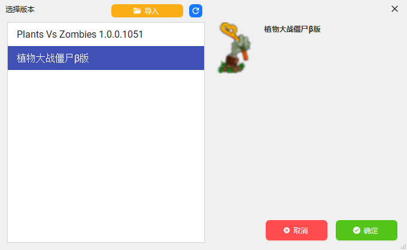
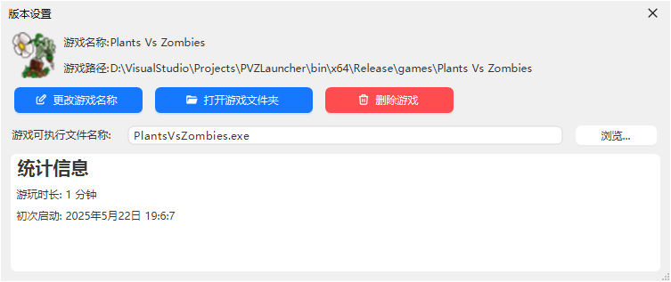
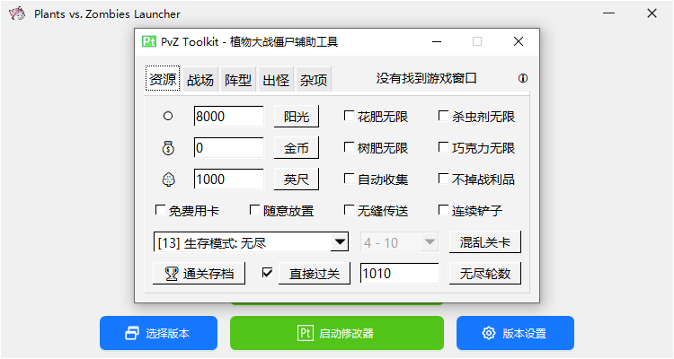
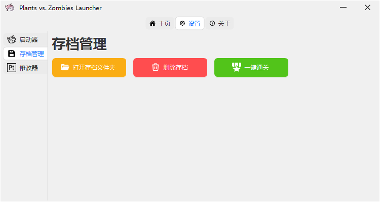
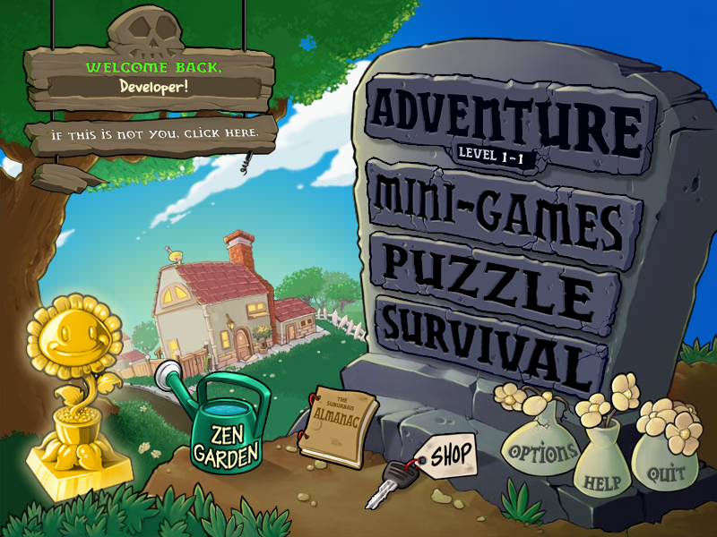

# Plants Vs. Zombies Launcher

## 下载

可直接在此仓库的Release界面下载最新版本

也可以使用以下的下载链接，但不能保证是最新版本:  
蓝奏云: 
123云盘主链接: 
123云盘备用链接: 
huang1111网盘: 
Gitee克隆库: 

## 概述

此启动器支持**启动、管理**游戏

## 特点

### 管理版本

本启动器可快捷地`导入、管理、启动`游戏；提供一个GUI交互界面，对游戏文件结构不熟悉的玩家也可以**轻松操作**

启动器还提供了一个统计信息界面，可以**查看自己的游玩时间**等

### 内置修改器

启动器内置一个修改器，不用再到处找修改器了；而且设置界面还提供了**修改器随游戏启动**的选项，也不用费劲去打开修改器了！

### 存档管理

修改器还提供了存档管理功能，不想打了可以直接**替换为已通关的存档**

## 为什么要制作这款启动器

现在的PVZ改版众多，下载下来**较难管理**，而且游戏文件过于**繁乱**。而且改版的文件结构不一，通常想要启动游戏都要花上一段时间；制作这款启动器就是为了让玩家们更好的**启动、管理**游戏

况且，现在网络上**没有任何一款PVZ启动器**，于是就只做了这款启动器

此启动器还内置了`Pvz Toolkit`修改器，可用于大部分版本的修改

## 依赖

程序使用`.NET Framework 4.8 WinForm`内核制作，使用`AntdUI(大部分UI)`与`ReaLTaiizor(小部分UI)`UI库

程序包内已包含两款UI库的dll文件，.NET Framework Runtime 可[点击此处](https://dotnet.microsoft.com/zh-cn/download/dotnet-framework)前往下载

## 引用

[.NET Framework 4.8 Runtime](https://dotnet.microsoft.com/zh-cn/download/dotnet-framework/net48) 
[AntdUI](https://gitee.com/antdui/AntdUI) 
[ReaLTaiizor](https://github.com/Taiizor/ReaLTaiizor)
