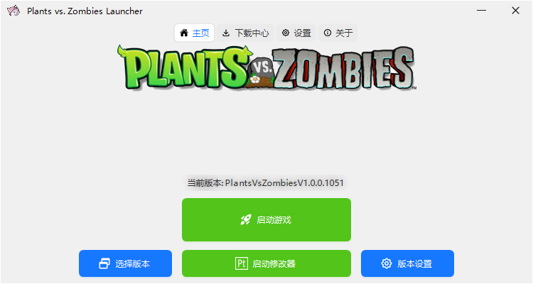

# Plants Vs. Zombies Launcher

[简体中文](README.md) | [English](README_en.md)

## Overview
This launcher supports **launching, downloading, and managing** games

## Why Create This Launcher
There are numerous PVZ mod versions available now, which are **difficult to manage** after downloading, and game files are often **overly cluttered**. Additionally, mod download sources vary, and searching for resources usually takes considerable time. This launcher was created to help players better **launch, download, and manage** games.

Besides, there is **no PVZ launcher available on the Internet at present**, so only this one was made

The launcher also includes a built-in `Pvz Toolkit` modifier that works with most versions.

## Dependencies
The program is developed using `.NET Framework 4.8 WinForm` core, with `AntdUI (majority UI)` and `ReaLTaiizor (minor UI)` libraries.

## References

[.NET Framework 4.8 Runtime](https://dotnet.microsoft.com/en-us/download/dotnet-framework/net48) 
[AntdUI](https://gitee.com/antdui/AntdUI) 
[ReaLTaiizor](https://github.com/Taiizor/ReaLTaiizor)